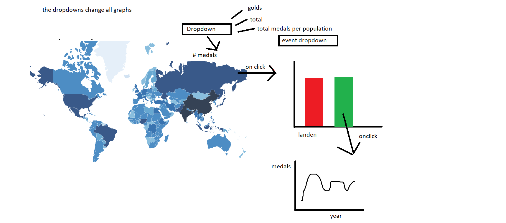

# dataproject concept proposal
 by Koen van der Kamp: 12466573
## Problem statement:
The olympic events are the most prestigious sports events known to us. Most of us had the question: how does my country compare to other countries?

## Solution:
By making a visualisation where the user can use an interactive website to make his own comparisons within his interest.

Proposed structure: Martini glass structure
force the user to first explore one country to get used to the interface. Only then be able to compare different countries

the __main features__ are __bold__:

1. __World heatmap of total medals__
  * continent support
  * __click on the world map to add countries to the  other charts__

2. __Bar chart__
    * __total medals by country__
    * __total medals per capita__
    * medals per athlete sent
    * __total medals in a specific event__
    * total medals over total GDP (might be interesting if time)
    * total medals in summer or winter
    * compare continents
    * __two dropdowns to make changes in all graphs__

3. __Side visualisation one__
  * __compare up to 5? countries over the years__ (user can pick the countries from the heatmap or barchart)
  * __compare countries in specific events__

### data sources:
* athlete_events.csv [source](https://www.kaggle.com/heesoo37/120-years-of-olympic-history-athletes-and-results)
* population data [source](https://github.com/datasets/population/blob/master/data/population.csv)

### external components:
* D3
* world map 02 update to d3 v4 [source](http://bl.ocks.org/micahstubbs/8e15870eb432a21f0bc4d3d527b2d14f)

### hardest parts:
i have no clue yet

### Inspirations and similar stuff

Website containing some of the ideas:
http://andybarefoot.com/olympics/index.html#population-talent

interesting notes:
data is made global.
Updates a single graph. For other graphs refers to other pages.

https://public.tableau.com/views/GDPandPopulationImpactonWinterOlympicPerformance/WinterOlympics?:embed=y&:display_count=yes&:showVizHome=no
