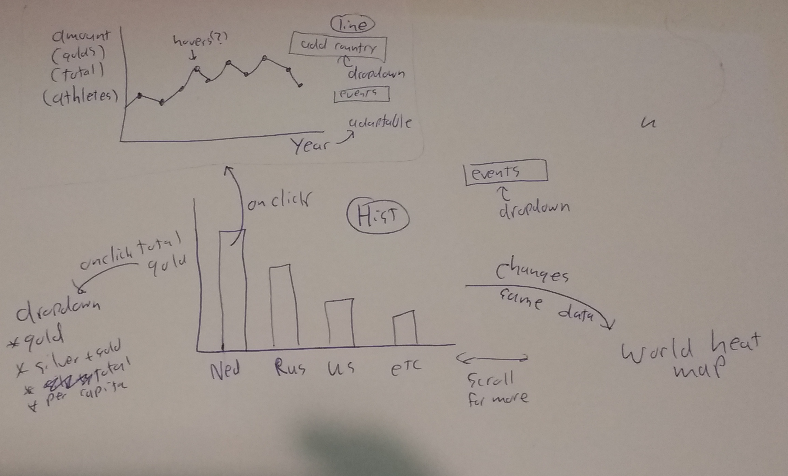

# dataproject rough concept

## Problem statement:
The olympic events are the most prestigious sports events known to us. Most of us had the question: how does my country compare to other countries?

## Solution:
By making a visualisation where the user can use an interactive website to make his own comparisons within his interest.

the __main features__ are __bold__:
1. __Bar chart__
    * __total medals by country__
    * __total medals per capita__
    * medals per athlete
    * total medals per GDP(?)
    * __total medals in a specific event__
    * total medals in summer or winter
    * compare continents

2. __World map color of the same data in 1 side by side__
    * continent support (compare continents?)

3.  __line graph__ (click on a country produces this)
    * __compare up to 5? countries over the years__ (clutter?)
    * __compare countries in specific events__

### data sources:
* athlete_events.csv [source](https://www.kaggle.com/heesoo37/120-years-of-olympic-history-athletes-and-results)
* other data maybe?

### external components:
* D3
* world heat map library?
* maybe some other graphic libraries

### hardest parts:
i have no clue linking stuff?
