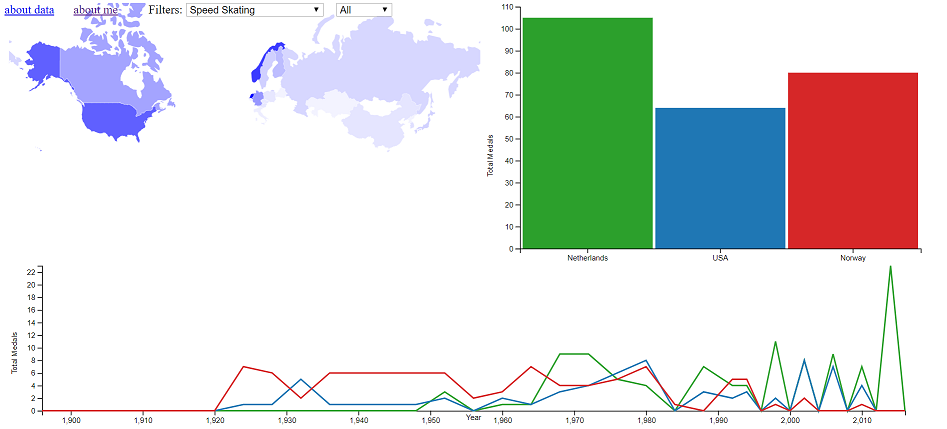
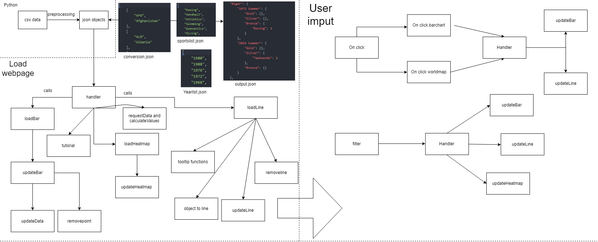

# Report Koen van der Kamp
# 31/01/2019
The web application allows a user to compare any country to other countries.
The comparison can be made in total medals and uses three different graphs:
1. Heatmap of the world
2. Bar chart comparing specific countries
3. Line chart to compare over the years
The charts can also be filtered on sports and on season.

extra features: resizes graphs to screen automatically, tutorial

# Final design
The preprocessing in python uses two files, scraper and csvtojson.py.

Scraper.py scrapes wikipedia for a national olympic comitee -> country name conversion list and outputs a json.

csvtojson.py converts the csv to a handy json designed specifically for my webpage. csvtojson uses the conversion.json.
Not only does it output the data (to output) it also makes a list of all the years and sports.
Years are useful to detect when a country has 0 medals
Sports is useful for the sportsfilter

My web application its core function is the 'handler' function (in the data and helpers file). This function calls all the relevant make graph functions (bar, line, heatmap). These functions then return the update function to update these graphs.

The update functions all require an object:

Bar/heatmap: {country: amount of medals} (bar is one country heatmap is all countries)

line: {year: medals} (lots of years)

Everything in the object will be added to the graph. These objects can be requested from the requestData function. This function takes in 2 parameters (country, kind of graph("bar" or "line")) both strings. if an empty string is given to the country parameter it will return all countries (for heatmap)

the final design can be seen in detail the following UML:

# handler:
1. starts tutorial
2. asks for data from server
3. calls every load function and assigns the update functions to the window
4. produces the nav bar.
5. produces the color function and assigns it to the window (every country same color)
6. sets up requestData for user requests

##### loadBar/Line/Heatmap:
Loads the barebone chart and defines some functions then returns the update function to update this barchart

Loadline needs one parameter a list for all the existing years so it can adjust the object recieved accordingly.

loadHeatmap and loadBar need no parameter

(all update bars can be called without arguments just to update)
##### updateBar:
updatebar has one parameter an object with {country: medal} to add to the barchart.

Also checks if the filter applied is correct if this is not correct it requests new data for every country. This is done by the local function updateData()

##### updateLine:
Updateline also has one parameter but the parameter is structured like: [country, {year: medals, year: medals}].

This object needs to be converted to an coordinate array. [x,y] objectoline() does this.

updateLine also checks the filter and requests updated data if the filter changes (updatedata())

updateLine always adds years not included in the given object by using addemptyyears().

the removal of a line needs to be acessed by the on click of the barchart and thus removeLine is assigned to the window (window.removeLine())

##### updateHeatmap:
Updateheatmap always requests new data because the only time its called is when the filters change. then updates accordingly

The proposal has been followed when possible. However some changes were made as seen in the following chart:

I will summarize the changes in comparison to the design.md and then explain my thought process behind them:

 (see [design.md](https://github.com/lameturkey/dataproject/blob/master/docs/diagram.png)

1. The 'data handler' function makes all the graphs and keeps track of the update functions. The load world map function should only load the world map while leaving more data centered operations to other functions.

2. The line and bar chart updates when clicked on the heatmap. Instead of the proposed onclick. This is a design question addressed in the first week of feedback (8/01/2019). I have chosen this approach because of a few reasons:
  1. Clicking on a line in a chart is hard
  2. Removing countries and adding would need two clicks (line and bar needs to be clicked) this solution is more user friendly.

3. The data structure of my json object is different. I lost some important features with the proposed data structure. (I.E. what sport?). Also two arrays would be difficult to traverse because you have to constantly lookup the index of the years to get the medals there. This is confusing, the final nested approach  is easier to traverse and filter trough.

4. I had to add two additional json objects to be read for other aspects. One for the total list of sports and one for all the year olympics were held. I chose to make an json of this because otherwise every time the window opens it has to find all the different sports and years cutting into my loading time.

5. I also had to scrape NOC -> country data. This was not anticipated but it is obvious I can't use national olympic comitee names to assign data to the world map.

6. The user input request for data is handled via the handler. This is to make the code as adaptable as possible for future features as no data has been made global. Only the function to request this data.

7. Population data was not used. I feel like the time needed to add another dataset would not be worth the feature (display medals/population on the y axis). Instead I devoted my time to debugging and making the code better and cleaner.

# Challenges
1. The best way to make a json of my data (data structure)
2. learning how geojson works in combination with paths and d3.
3. How enter(), merge(), exit() work in detail. (with and without a key function)
4. Lots and lots of clarity and user focused updates (legenda with bar chart, clicking on the ticks, line graphtooltip, no data means no medals, consistency between tooltips for more see the process.md). This was a bigger part of the project than I anticipated.
5. Working clean with comments. I didn't use var in the beginning, this caused a lot of bugs later in the development stage. Reading your own code is hard when there are no comments.
6. Transitions. Transitions do not necessarily have a value. When I used transitions in my line graph the lines started turning into each other and thus confusing for users. The bar chart transitions appeared from the upper left. The added value of debugging these transitions does not outweigh the time needed to debug these features. The axis transition however feels good and was easy to implement.
