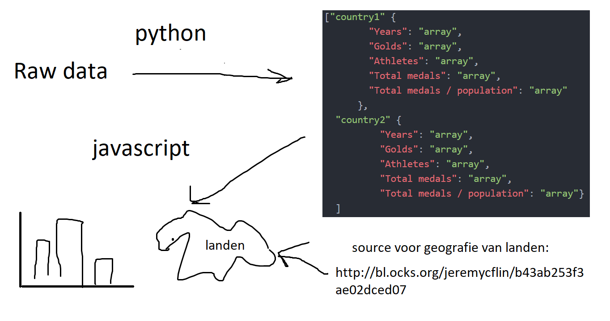
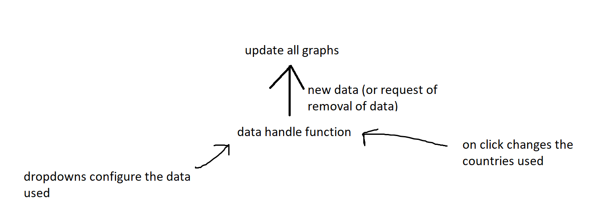

# design proposal
### data sources:
* athlete_events.csv [source](https://www.kaggle.com/heesoo37/120-years-of-olympic-history-athletes-and-results)
* population data [source](https://github.com/datasets/population/blob/master/data/population.csv)

(present on github)

All data should made ready with python. Try to only make minor changes or no changes to the data with js.

#### Datacleaning in python:
  1. remove all athletes with no gold medals.
  2. transform the data to a single json

#### javascript code:

* one main function that 'handles' the data and passes it to other graphing functions for other graphs
* world map used d3-tip unsure if this adds value to my project

