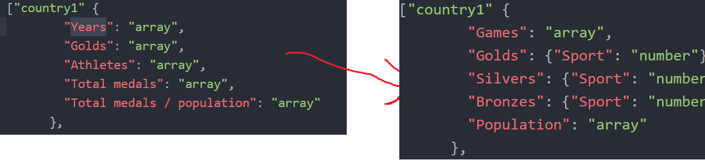

# day 1
##### 7/01/2019
the martini glass was chosen to be the way of story telling over the other because i want the user to be able to compare countries after learning how the website works

Toughts on design process:
* combine and change the data into easy to use .json
* make all changes to the data in python beforehand
* global data variables

# day2
##### 8/01/2019
Using http://bl.ocks.org/jeremycflin/b43ab253f3ae02dced07 for the heatmap

### feedback:
suggestion: click on world map and show in both graphs.
i also think this works better.

Need a way to see what golds belong to what sports this is not included in my json object right now. adjusted accordingly (see the picture). Also adjusted some other values for easier acess

found a way to remove duplicates from a list of dicts online:
https://stackoverflow.com/questions/7090758/python-remove-duplicate-dictionaries-from-a-list

# day 3
##### 9/01/2019
#todo
1. how does worldmap work
2. add population to the json

adding population to the json is too much work (manually converting names and such) prostponed to later date. This also averted my attention to the fact i need a way to convert the NOC to (national olympic comitiees to the names of the countries). I scraped this data from wikipedia (https://en.wikipedia.org/wiki/List_of_IOC_country_codes)

# day 4
##### 10/01/2019
1. worldmap is kinda working
manually needed to change a few names to be compatible  with the names in the geojson these countries are still not found:
FRG
charts.js:46 YUG
charts.js:46 URS
charts.js:46 GDR
charts.js:46 IOA
charts.js:46 EUN
charts.js:46 TCH
charts.js:46 SCG
charts.js:46 ANZ
charts.js:46 BOH
charts.js:46 UAR
charts.js:46 WIF
charts.js:46 AHO
charts.js:46 Barbados
charts.js:46 Bermuda
charts.js:46 Bahrain
charts.js:46 Grenada
charts.js:46 Hong Kong
charts.js:46 Virgin Islands
charts.js:46 Liechtenstein
charts.js:46 Monaco
charts.js:46 Mauritius
charts.js:46 Singapore
charts.js:46 Serbia
charts.js:46 Tanzania
charts.js:46 Tonga
charts.js:46 Chinese Taipei

adapted my design structure

little space for the graphs.
maybe make the navigation in bootstrap above (idea)

# day 5
##### 11/01/2019

I'm having trouble acessing my data trough my functions. Looking up more information about scopes and functions
Tried to help somone with geojsons. ended up learning a bit about them

# day 6
##### 14/01/2019

Making the line script working

For the line script a need for filtering is needed. Calculatevalues can now filter and give appropirate return objects

# day 7
##### 15/01/2019
lots of problems with .enter() .data() .datum() .merge() trying to figure out how they work in depth

problem solved line chart now fully functional maybe add legenda

# day 8
##### 16/01/2019
  * dropdown 1 working with update all graphs
  * struggle with variables. i did not use var, was a big mistake.

# day 9
##### 17/01/2019
 * last dropdown working
 * i notice that the code is very hectic with alot of stuff that doens't do anything.
 * fixed a bug where summer and winter are simultainiously

 I will dedicate the rest of today to cleaning the code and making it better (maybe tomorrow also)

 Axisoptions as a dropdown will be hard because i need to load in new data. The two dropdowns are "sports"  en "Summer/Winter/All"

# day 10
##### 18/01/2019
 * Geen data op een bepaalde spelen is aangegeven als 0 medailles. dit fixen.
 * bar charts zelfde kleur als line chart maken dan is de bar chart een soort van de legenda voor de line graph

 1 is fixed 2 ook

# day 11
##### 21/01/2019
als je filtert op zomerspelen dan worden alle winterspelen als 0 medailles weergeven op de line chart. (bug)
fixed

add tooltip for line chart

# day 12
##### 22/01/2019
General fixing of code and using comments (Wow!!!)

Maybe make colorcode better so the colors dont change when you click on countries??

# day 13
##### 23/01/2019
colors fixed.
removed transition from the bar chart because it was weird.

updated bar chart and line chart

Tooltip update to be the same as the heatmap tooltip

# day 14
##### 24/01/2019
hackaton

# day 15
##### 25/01/2019
I need some sort of explanation to the graphs. and axistitles intro slideshow.

make button to remove all lines and bars

also fix the line tooltips for consistancy

use the width and height of the window

use width and height now working.
fixed the line tooltips to reflect better on the heatmap tooltips.
Introduced a slideshow at load of the page
